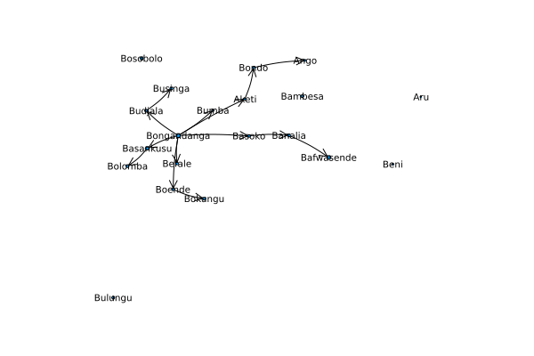
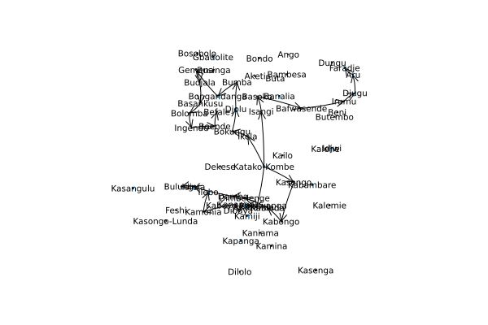
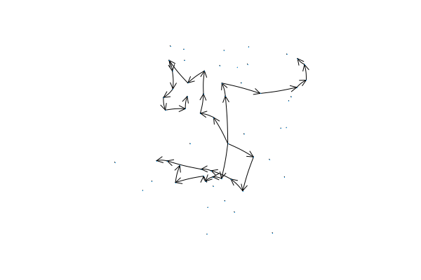

# apoc-model
Modeling and optimizing the distribution of ivermectin for the treatment of onchocerciasis.

## Results

20 locations, 2 vehicles:

20 locations, 7 vehicles:

40 locations, 3 vehicles:

60 locations, 4 vehicles:

